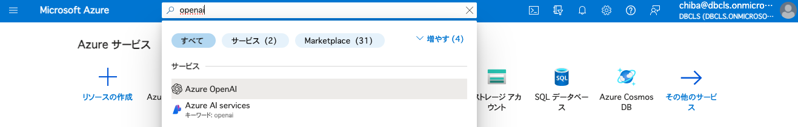
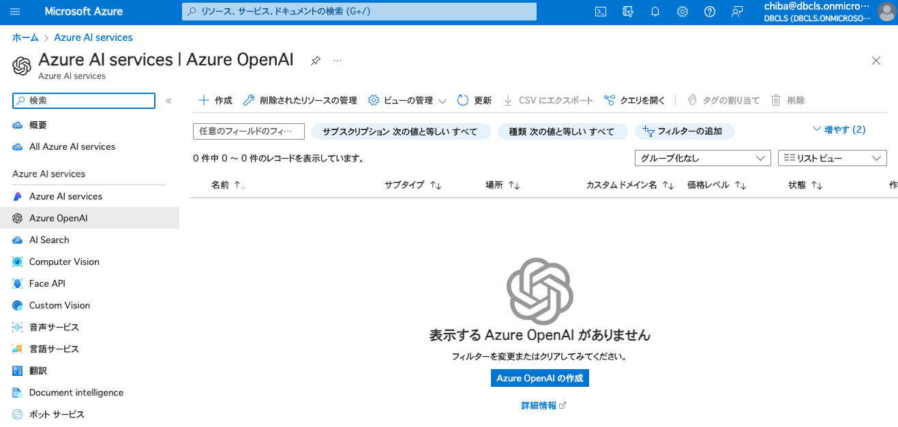
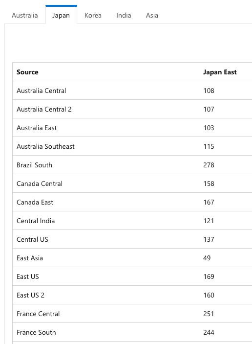
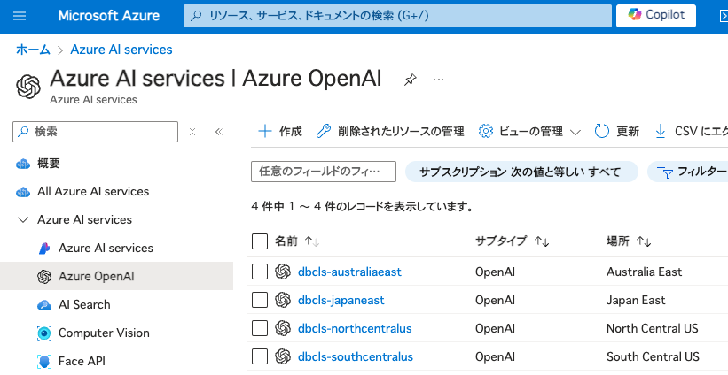
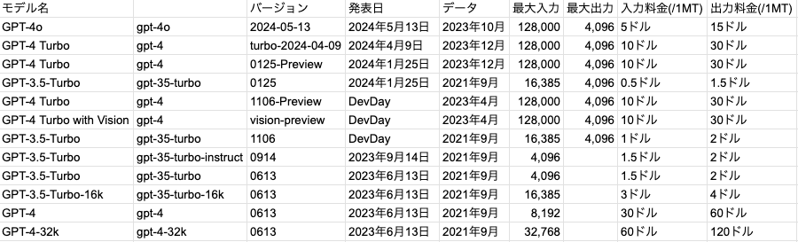
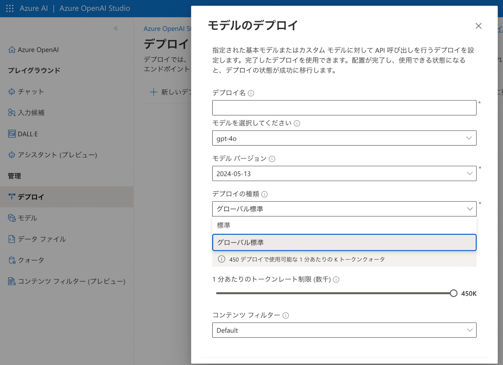
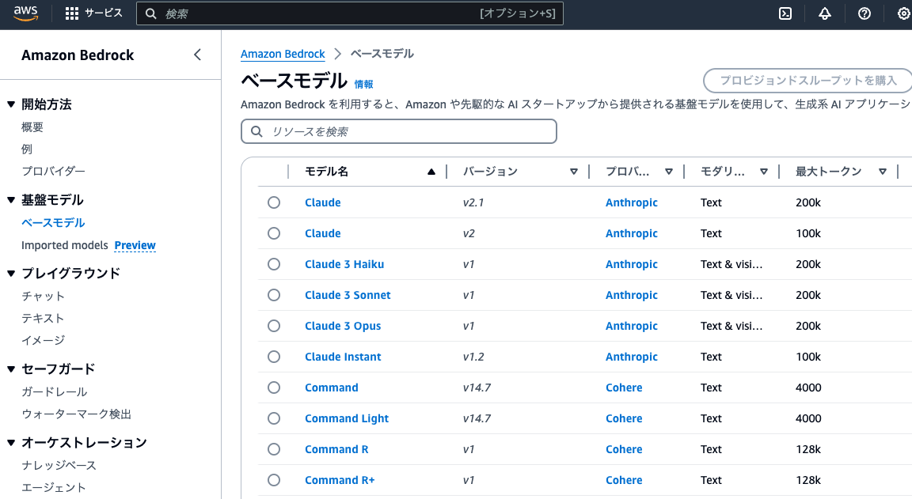
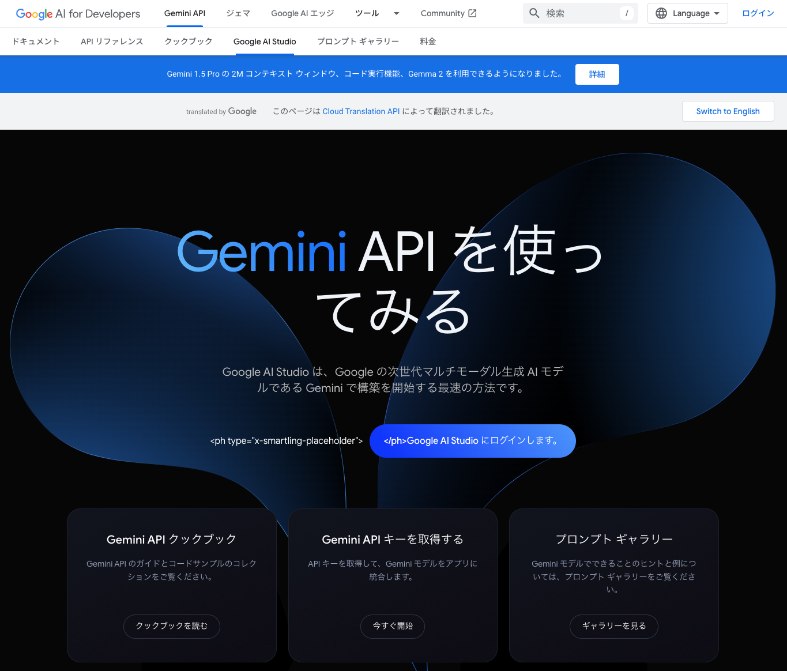

# LLMに関する各種サービスやモデルの試用と評価

# 目的

様々なLLMが発表されているので、それらを試して評価したい。

プロプライエタリなLLMとしては、OpenAI、Anthropic、Google各社が発表している。

また、オープンなモデルに関しては、Hugging Faceから利用できる。

それぞれ実行方法が異なるので、まとめておく。

# 前提

再現するには以下のようなスキルが必要

- UNIXコマンドの扱いができる
- Pythonによる簡単なスクリプトの記述ができる

# Azure OpenAI

OpenAIのモデルに関しては、Microsoft Azure上でデプロイできる。

Microsoft Azure上で、OpenAIの利用を申請していれば、OpenAIのモデルをデプロイして使うことができる。

Azureのリソース作成する際には、どのリージョンに作成するかを検討する必要がある。

Azureのリージョンごとに、使えるモデルが微妙に異なる。このあたりの情報については、ドキュメントを見ても追いついていないことが多いので、[Azure CLI](https://learn.microsoft.com/ja-jp/cli/azure/reference-index?view=azure-cli-latest)を使って情報を取得するのが確実である。コマンド az account list-locations でリージョンをリストアップしたあと、az cognitiveservices model list --location japaneast のように各リージョンを指定して、利用可能なモデルのリストを取得することができる。例えば、2024年7月23日現在、gpt-4oが使えるリージョンは、以下の通りである。

name regionalDisplayName

southafricanorth (Africa) South Africa North

australiaeast (Asia Pacific) Australia East

japaneast (Asia Pacific) Japan East

koreacentral (Asia Pacific) Korea Central

southindia (Asia Pacific) South India

canadaeast (Canada) Canada East

francecentral (Europe) France Central

germanywestcentral (Europe) Germany West Central

norwayeast (Europe) Norway East

polandcentral (Europe) Poland Central

swedencentral (Europe) Sweden Central

switzerlandnorth (Europe) Switzerland North

uksouth (Europe) UK South

westeurope (Europe) West Europe

brazilsouth (South America) Brazil South

eastus (US) East US

eastus2 (US) East US 2

northcentralus (US) North Central US

southcentralus (US) South Central US

westus (US) West US

westus3 (US) West US 3

---

リージョンによって、どれくらいのレイテンシーが発生するかは[マイクロソフトのドキュメント](https://learn.microsoft.com/en-us/azure/networking/azure-network-latency?tabs=APAC%2CJapan)に記載がある。日本と北米あるいはオーストラリアとの間では、およそ100ms以上のレイテンシーが発生するが、LLMのレスポンスが数秒以上かかることを考えれば、さほど気にはならないだろう。

以下は、いくつかのOpenAIリソースを作成した状態である。リソース名がエンドポイントのURLに使われることに注意して名前を付ける必要がある。[テナント名]-[リージョン名]としておけば、分かりやすく、かぶることも少ないだろう。リソースが所属するリソースグループについては、必ずしもリソースと同じである必要はない。ここでは簡単のため、japaneastリージョンにopenaiリソースグループを1つ作成し、OpenAIリソースは全てそこに所属させることにした。作成した各リソースについて、異なるAPIキーが発行されることに注意する。

モデル名だけを見ていると、混乱することがある。小文字のモデル名とバージョンの組み合わせで確認する必要がある。例えばGPT3.5-Turbo(バージョン0613)の最大入力は4,096だが、バージョン1106だと16,385となっている。GPT3.5-Turbo-16k(バージョン0613)の最大入力が16,385だったが、同等の性能で半額になっているので、GPT3.5-Turbo-16kを選ぶ理由はない思われる。これを知らないと、つい-16kが付いたモデルを高性能だと思って選択してしまうかもしれない。同じ性能を持つモデルであっても、バージョンアップするごとに、費用が安くなっている。各モデルの費用は、以下の通りである (100万トークンあたりの料金)。

実際に利用可能なAPIを立ち上げるには、Azureポータルから、OpenAI Studioという別のサイトに移動して、特定のモデルをデプロイする必要がある。

ここで注意すべきことがあるとすれば、クオータの調整である。デフォルトの設定だと、クオータにすぐ達してしまい、レスポンスが返ってこないことがある。そこで、「1分当たりのトークンレート制限」を最大に設定した。デプロイの種類で「標準」と「グローバル標準」が選べるときは、「グローバル標準」を選択した。これによって、トラフィックが分散され、クオータが増えることになる。

モデルがデプロイできたら、プレイグラウンドで動作確認をすることができる。

また、「コードを表示」からPythonなどのサンプルコードを表示させることができる。

ローカル環境にPythonのopenaiライブラリーをインストールし、APIキーを環境変数として設定すれば、PythonコードからAPIを利用することができる。

実際の使用にあたっては、いくつかパラメータを調整した。temperatureは0、max_tokensは2048とした。

# Amazon Bedrock

AWSでは、OpenAI以外の、様々なモデルを利用することができる。Anthropicが出しているClaudeだけでなく、CohereやMeta, Mistral AIなどが出しているオープンなモデルもある。

AWSのリージョンごとに使えるモデルは異なる。例えば、2024年7月23日現在、Claude 3 Opusが使えるのはus-west-2(オレゴン)のみであった。また、Claude 3.5 Sonnetが使えるのは、us-east-1(バージニア北部)のみであった。

# Google Gemini

Geminiは、Google AI StudioにGoogleアカウントでログインし、APIキーを取得すれば、使えるようになる。

# Hugging Face

Hugging Faceでは、多くのオープンなモデル公開されている。ローカル環境に十分なGPUを備えたコンピュータがあれば、これらを実行することができる。

たとえば、[https://huggingface.co/elyza/Llama-3-ELYZA-JP-8B](https://huggingface.co/elyza/Llama-3-ELYZA-JP-8B)

にあるPythonのサンプルコードを実行してみる。torchやtransformersなどのPythonライブラリがインストールされていれば実行可能である。

モデルが、ローカルの.cache/huggingface/hub/以下に、ダウンロードされる。

GPUにロードされ、推論が実行されたあと、GPUは解放される。

サービスとして立ち上げておくには、Pythonでロードした後、問い合わせを待つようにする。

ここでは、Flaskを使って、エンドポイントを立ち上げておく。

# API